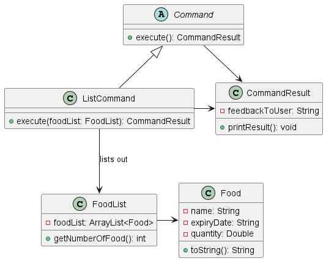
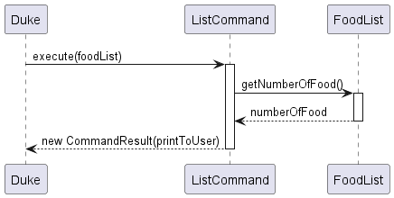
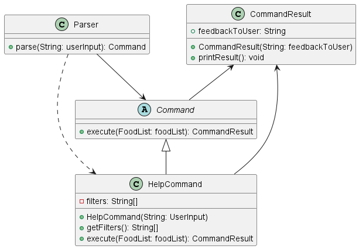

# Developer Guide

+ [Acknowledgement](#acknowledgement)
+ [Design](#design)
  + [Architecture Design Diagram](#architecture-design-diagram)
  + [UML Sequence Diagram](#uml-sequence-diagram)
+ [Implementation](#implementation)
  + [Add feacture](#add-feature)
  + [Remove feature](#remove-feature)
  + [Find feature](#find-feature)
  + [List feature](#list-feature)
  + [Clear feature](#clear-feature)
  + [Help feature](#help-feature)
  + [Exit feature](#exit-feature)
+ [Appendix: Requirements](#appendix--requirements)
  + [Product Scope](#product-scope)
  + [User Stories](#user-stories)

## Acknowledgement

The documentation and organisation of our project follows the recommended format in [SE-Education](http://se-education.org/addressbook-level3/DeveloperGuide.html).
Part of the code is inspired by the [addressbook-level3](https://github.com/se-edu/addressbook-level3)

## Design
### Architecture Design Diagram

Main components of the architecture

`Duke` is the entry point of the application. It is responsible for, 
+ At app launch: Initializes the components in the correct sequence, and connects them up with each other.
+ At shut down: Shuts down the components

The rest of the App consists of five components:
+ Ui: The UI of the App. This part displays the messages to the user.
+ Parse: Parse user input.
+ Command: The command executor.
+ CommandResult: The command result display, displaying the command result.
+ Storage: Reads data from, and writes data to, the hard disk.
<<<<<<< HEAD
+ Parser: The command parser. Identify the various command type.
=======
+ CommandResult: Prints response to users.
>>>>>>> 58a04fae95bc117e9be4b678f64fc27a7b3eabd6

### UML Sequence Diagram

---

## Implementation

### Add feature

The add feature is implemented using a `AddCommand` class extending from `Command` Class. 
`AddCommand` contains an `execute` methods, which utilises the internal `spiltDetails` methods to extract the food details
and to construct new `food` object .
It is also facilitated by `Foodlist` Class, using `addFood` method of `FoodList` Class.

The add feature implementation is as follows:
1. New AddCommand object is created by passing in a String containing food details
2. `splitDetails` is called to split the string using different flags `-n`,`-e`,`-c`,`-q`,`-u`;
3. After obtaining an array of String, it will check the correctness of each parameter. It will specially check the date 
and the quantity. If the `date` is not a valid date (e.g. 02/15/2024)or it is before the current date
(meaning expired food), it will return a `CommandResult` object, and `Duke` will continue print the command result.
4. If there is no error, it will create a new `Food` object, based on the parameter number contained in the array.
5. `addFood` is called to add the new food into the food list
6. Return a `CommandResult` to show the successful message to the user

**Class Diagram**

**Sequence Diagram**

### Remove feature
The remove command is implemented using a `RemoveCommand` class which
utilizes `removeFood` method of the FoodList.

The `removeFood` method implementation is as follows:
1. New `RemoveCommand` object is created by passing in a String containing arguments from `Parser`.
2. The `index` of the item to be deleted will be taken as its arguments.
3. The method `execute` of `Command` class will be called from `Duke` with the `index`.
4. This method will determine if there exist a food item with that `index` in the `FoodList`.
5. If it exists, the food item will be deleted and feedback to the user that it has been successfully removed.
6. Otherwise, the feedback will be an error message
7. This method will return an object called `CommandResult` and pass `feedbackToUser` as its argument.
8. `Duke` will subsequently call `printResult` method from `CommandResult`.

**Class Diagram**

**Object Diagram**

### Find feature
The find command is implemented using a `FindCommand` class which
utilizes `findFood` method of the FoodList.

The `findFood` method implementation is as follows:
1. Initialize `FoodList` result variable
2. Start a loop iterating over each foodItem 
3. Do word processing on a term and check if the foodItem name includes it
4. Enter a loop with switch statement for each component of the `flags` argument 
5. If some flag is not satisfied, continue the loop without adding foodItem to the result
6. If the flags loop is over, the flags conditions were satisfied, so add the foodItem to the result

**Class Diagram** 

**Sequence Diagram**

### List feature
The list command is implemented using a `ListCommand` class which utilizes `COMMAND_WORD`
attributes of all other commands within the `commands` package.

The list command is implemented as follows:
1. New `ListCommand` object created will call the method `execute` of `Command` class.
2. The method `execute` decides what to append to the string `printToUser` according to `foodList`. 
3. `foodList` is an object of type `FoodList` that is passed as argument to `execute`, it consists of the list of food 
that has been added by user.
4. `foodList` contains of `Food` that has undergoes the `toString` method.
5. `execute` will check if `numberOfFood` is greater than 0, in which `numberOfFood` is obtained from the `FoodList` 
function `getNumberOfFood`.
6. If `numberOfFood` is greater than 0,  the foodList in String will be appended to `printToUser`. If it is not, then 
the empty `foodList` will not be appended to `printToUser`.
7. After appending the `foodList`, the method `execute` will return an object called `CommandResult` and pass          
`printToUser` as its argument.
8. `Duke` will then call `printResult` method from `CommandResult` which will print the food list for the user.

**Class Diagram**

**Object Diagram**

### Clear feature
The clear command is implemented using a `ClearCommand` class which utilizes `COMMAND_WORD` attributes to all other 
commands within the `commands` package.

The clear command is implemented as follows:
1. New `ClearCommand` object created will call the method `execute` of `Command` class.
2. The method `execute` decides what to append to the string `printToUser`.
3. The method `execute` calls the method `clearFoodList` in FoodList to remove all the objects (Food) in FoodList.
4. After the method `clearFoodList` has finished executing, `execute` will return an acknowledgement message to user.

**Class Diagram**

**Sequence Diagram**

### Help feature
The help command is implemented using a `HelpCommand` class which utilizes `COMMAND_WORD` 
attributes of all other commands within the `commands` package. 

The help command is implemented as follows:
1. When `Duke` reads the user input, it calls the method `parse` from the `Parser` class.
2. The `parse` method process which command word is being queried and calls the constructor class based 
on the command word.
3. In the case where `help` is the command word, a new `HelpCommand` object is created with the rest of the user input 
being the arguments for the constructor.
4. The constructor `HelpCommand` will split the arguments based on the `--` regex and store them in an array of
strings called `filters`.
5. The method `execute` of `Command` class will then be called all the way from `Duke` which will be overriden by the 
same method in `HelpCommand`.
6. This method calls the private method `appendMessage` which decides what to append to the string `printToUser` as 
specified by `filter`. 
7. After looping through all the `filter`, this method will return an object called `CommandResult` and pass
`printToUser` as its argument.
8. `Duke` will then call `printResult` method from `CommandResult` which will print the necessary message.

**Class Diagram**

**Sequence Diagram**

### Exit feature
The exit command is implemented using a `ExitCommand` class which utilizes `COMMAND_WORD` attributes of all other 
commands within the `commands` package.

The exit command is implemented as follows
1. When `Duke` reads the user input, it calls the method `parse` from the `Parser` class.
2. The `parse` method process which command word is being queried and calls the constructor class based
   on the command word.
3. In the case where `exit` is the command word, a new `ExitCommand` object is created with the rest of the user input
   being the arguments for the constructor.
4. The method `execute` of `Command` class will then be called all the way from `Duke` which will be overridden by the
   same method in `ExitCommand`.
5. This method append the exiting message to the string `printToUser`, and return an object called `CommandResult` and 
pass `printToUser` as its argument
6. `Duke` will then call `printResult` method from `CommandResult` which will print the necessary message.
7. `Duke` will further call `isExit` method from `ExitCommand` which will then change `isExit` from `false` to `true`,
which will then exits the program.

**Class Diagram**

**Sequence Diagram**

---
## Appendix: Requirements
# Product Scope
**Project Direction**
- Food Supplies Tracker: Main function is to track expiry dates 
and storage area of foods as to minimise food shortage.

- **Target user profile:**
- Kitchen worker, Homemaker
- has a need to manage food
- prefer desktop apps over other types
- can type fast
- prefers typing to mouse interactions
- is reasonably comfortable using CLI apps

**Value proposition:**
1) Manage food supply faster than a typical mouse / GUI driven app
2) Check the expiry date of a particular food quickly
3) Check the foods in the most recent expiry dates quickly
4) Get suggestions and alert to consume foods that are going to expire soon

Currently, the following functionality was implemented:

`add -n PRODUCT_NAME -e EXPIRY_DATE `

`add -n PRODUCT_NAME -e EXPIRY_DATE -c CATEGORY `

`add -n PRODUCT_NAME -e EXPIRY_DATE -p QUANTITY `

`add -n PRODUCT_NAME -e EXPIRY_DATE -c CATEGORY -p QUANTITY`

`add -n PRODUCT_NAME -e EXPIRY_DATE -p QUANTITY -u UNIT`

`add -n PRODUCT_NAME -e EXPIRY_DATE -c CATEGORY -p QUANTITY -u UNIT`

`list`

`clear`

`find {PRODUCT_NAME}`

`find {PRODUCT_NAME} -fresh`

`find {PRODUCT_NAME} -expired`

`help {--COMMAND_WORD}`

# User stories

| Priority | As a...             | I want to ...                                                         | So that I can...                                                | Current Feature Available |
|----------|---------------------|-----------------------------------------------------------------------|-----------------------------------------------------------------|---------------------------|
| `* * *`  | Forgetful cook      | be reminded of what is left in my fridge                              | use the food wisely and avoid repetitive purchasing.            | `list`                    |
| `*`      | Forgetful cook      | get all meals for the next `x` days with their ingredients            | plan my grocery trips accordingly.                              | nil                       |
| `* *`    | Lazy cook           | get recommended recipes based on what I have left in the  fridge  | can spend less time considering what to cook today.             | nil                       |
| `* * *`  | Lazy cook           | have an efficient method of updating what leftover ingredients I have | spend less time using the software.                             | `add -n`                  |
| `* * *`  | Lazy cook           | check the lists of food fast                                          | waste less effort digging through the fridge / kitchen.         | `list`                    |
| `* * *`  | Busy cook           | get reminded on the products which will expire soon                   | prepare a meal based on it.                                     |                           |
| `* * *`  | Busy cook           | get reminded on the products which will expire soon                   | plan my grocery purchases accordingly.                          |                           |
| `* * *`  | Busy cook           | check the availability of certain food fast                           | waste little time digging through the fridge / kitchen.         | `find`                    |
| `* * *`  | Prudent cook        | check the expiry dates of food in fridge / kitchen                    | don't waste food due to food expiring and spoiling.             | `find`                    |
| `* *`    | Disorganised person | organise food by categories at least in a program (fruits,veggies...) | don't spend time looking for the food scattered in the kitchen. | nil                       |
| `* *`    | Prudent cook        | track the amount of different products I have                         | know how many portions I can cook.                              | nil                       |
| `*`      | Creative cook       | replace some products with others                                     | add potential replacement for the product.                      | nil                       |     
| `*`      | Inexperienced cook  | know how much to cook based on the number of people eating            | prepare the correct amount of food.                             | nil                       |  
| `* * *`  | Cook                | add product (name, expiry date, category etc)                         | keep my program updated.                                        | `add -n -e`               |
| `* * *`  | Cook                | remove product                                                        | keep my program updated.                                        | `remove`                  |

# Non-Functional Requirements
1) Should work on any mainstream OS as long as it has Java 11 or above installed.
2) Should be able to hold up to 9999 food products without a noticeable sluggishness in performance for typical usage.
3) A user with above average typing speed for regular English text (i.e. not code, not system admin commands) should be able to accomplish most of the tasks faster using commands than using the mouse.